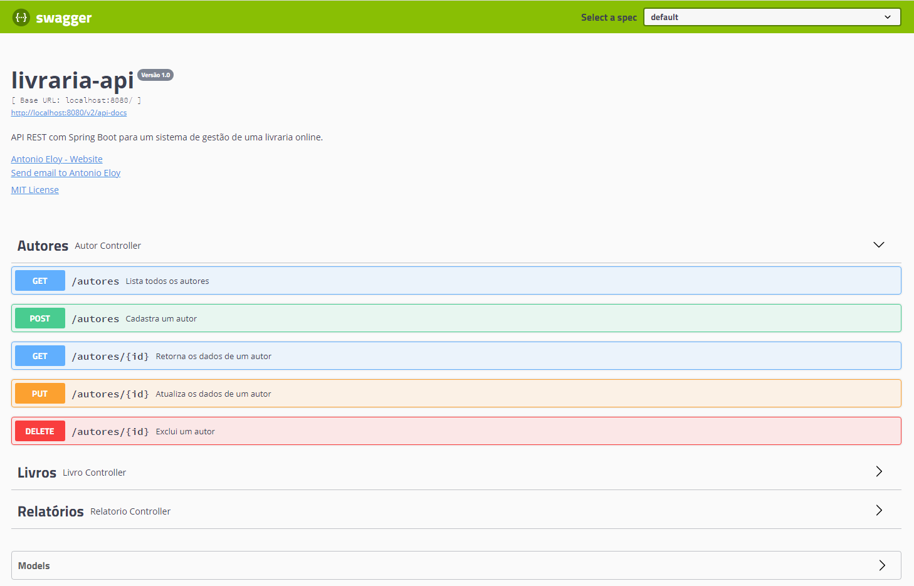

<h1 align="center">
  
</h1>

# :computer: livraria-api
API REST com Spring Boot para um sistema de gestão de uma livraria online.

Este projeto foi desenvolvido ao longo do Bootcamp Java Alura 2021.

### :bookmark_tabs: Tabela de conteúdos
* [Status do projeto](#status)
* [Tecnologias](#tecnologias)
* [Features](#features)
* [Pré-requisitos](#requisitos)
* [Executando a aplicação](#executando)
* [Testando a aplicação](#testando)
* [Licença](#licenca)

<a name="status"/></a>
### :hourglass: Status do projeto
Concluído.

<a name="tecnologias"/></a>
### :hammer_and_wrench: Tecnologias

As seguintes tecnologias e ferramentas foram utilizadas no desenvolvimento deste projeto:

- [Java](https://www.oracle.com/java/)
- [Spring Boot](https://spring.io/projects/spring-boot)
- [Spring Boot Starter Web](https://mvnrepository.com/artifact/org.springframework.boot/spring-boot-starter-web)
- [Spring Boot Starter Validation](https://mvnrepository.com/artifact/org.springframework.boot/spring-boot-starter-validation)
- [Spring Boot Starter Data JPA](https://mvnrepository.com/artifact/org.springframework.boot/spring-boot-starter-data-jpa)
- [Spring Boot Starter Security](https://mvnrepository.com/artifact/org.springframework.boot/spring-boot-starter-security)
- [Spring Boot Starter Test](https://mvnrepository.com/artifact/org.springframework.boot/spring-boot-starter-test)
- [Spring Boot DevTools](https://mvnrepository.com/artifact/org.springframework.boot/spring-boot-devtools)
- [Springfox Swagger](http://springfox.github.io/springfox/)
- [Flyway](https://flywaydb.org/)
- [Lombok](https://projectlombok.org/)
- [ModelMapper](http://modelmapper.org/)
- [Maven](https://maven.apache.org/)
- [MySQL](https://www.mysql.com/)
- [Git](https://git-scm.com/)
- [Docker](http://modelmapper.org/)

<a name="features"/></a>
### :page_with_curl: Features
- [x] Listar todos os autores
- [x] Cadastrar um autor 
- [x] Retornar os dados de um autor
- [x] Atualizar os dados de um autor
- [x] Excluir um autor   
- [x] Listar todos os livros
- [x] Cadastrar um novo livro
- [x] Retornar os dados de um livro
- [x] Atualizar os dados de um livro
- [x] Excluir um livro 
- [x] Listar usuários     
- [x] Cadastrar um usuário
- [x] Atualizar um usuário
- [x] Retornar um usuário
- [x] Remover um usuário  
- [x] Gerar relatório de quantidade de livros por autor 

<a name="requisitos"/></a>
### :pencil: Pré-requisitos

Antes de começar, você precisa ter instalado em sua máquina as seguintes ferramentas:
- [Git](https://git-scm.com/)
- [Docker](https://www.docker.com/)

<a name="executando"/></a>
### :rocket: Executando a aplicação

```bash
# Clone este repositório
$ git clone https://github.com/antonioeloy/livraria-api.git

# Na pasta raiz do projeto, execute os contêineres da aplicação
$ docker-compose up

# A aplicação iniciará na porta 8080
```

<a name="testando"/></a>
### :gear: Testando a aplicação

Para testar a API, basta acessar a documentação gerada com a biblioteca [Springfox Swagger](http://springfox.github.io/springfox/).

```
http://localhost:8080/swagger-ui.html
```

<h1 align="center">
  
</h1>

<a name="licenca"/></a>
### :copyright: Licença

Este projeto está licenciado nos termos da licença MIT.


